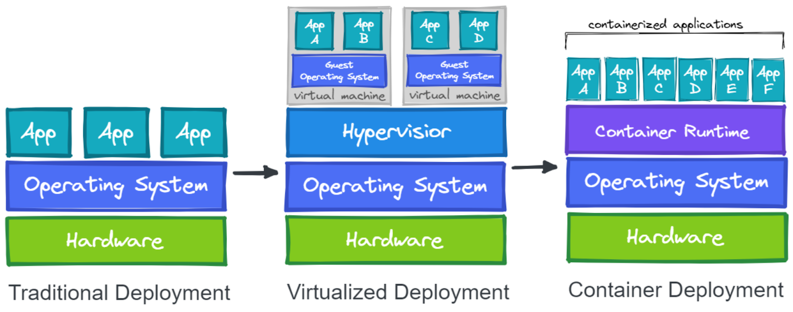

# Container Basics

- Container tech older than expected
- Early precursor: chroot command
- Introduced in Version 7 Unix (1979)
- Chroot isolates process from root filesystem
- Simulates new root directory
- Result: "chroot jail"
- Files hidden from process but still on system

Chroot directories can be created on various places in the filesystem

- **Chroot Still Relevant:**
    - Chroot remains in use by some contemporary software projects.
    - Modern container technologies retain the fundamental concept of chroot, incorporating advanced features.
- **Enhanced Process Isolation:**
    - Current Linux kernels offer advanced features for heightened process isolation.
    - Key technologies include namespaces and cgroups.
- **Linux Kernel 5.6 Namespace Features:**
    - **pid (Process ID):** Assigns a unique set of process IDs to a process.
    - **net (Network):** Provides a complete network abstraction, enabling individual IP addresses for processes.
    - **mnt (Mount):** Manages filesystem views and mount points, abstracting the file system.
    - **ipc (Inter-Process Communication):** Ensures separation of named shared memory segments.
    - **user:** Assigns processes their own set of user IDs and group IDs.
    - **uts (Unix Time Sharing):** Enables processes to have distinct hostnames and domain names.
    - **cgroup (Control Group):** A newer namespace facilitating the creation of isolated cgroup root directories.
    - **time:** The latest namespace, used for virtualizing the system clock.
- **cgroups for Resource Management:**
    - cgroups organize processes hierarchically and allocate resources such as memory and CPU.
    - Example: Limiting an application container to 4GB of memory involves utilizing cgroups to enforce these limits.

Traditional Deployment vs Virtualized Deployment vs Container Deployment

- **Docker Overview:**
    - Launched in 2013, Docker is synonymous with container building and execution.
    - Docker ingeniously combined existing technologies to enhance container accessibility and user-friendliness.
- **Container vs. Virtual Machine Distinction:**
    - Containers, despite initial similarities, differ significantly from virtual machines.
    - Virtual machines emulate an entire machine, including OS and kernel, while containers share the host machine's kernel, functioning as isolated processes.
- **Container Advantages Over Virtual Machines:**
    - Containers exhibit notable advantages over virtual machines:
        - Faster startup times.
        - Smaller footprint.
        - Reduced resource usage.
- **Traditional vs. Virtualized vs. Container Deployment:**
    - Deployment methods:
        - Traditional: Standard deployment.
        - Virtualized: Utilizes virtual machines with some overhead.
        - Container: Leverages containers for efficiency, faster startup, and reduced resource usage.
- **Hybrid Approach:**
    - Often, the choice isn't between containers and virtual machines but a combination of both.
    - Hybrid use allows harnessing container efficiency while retaining the enhanced security advantages provided by the greater isolation of virtual machines.

### [**Container Orchestration**](https://kevinsulatra.github.io/k8snotes/kcna_notes/container_orchestration/container_orchestration.html)
