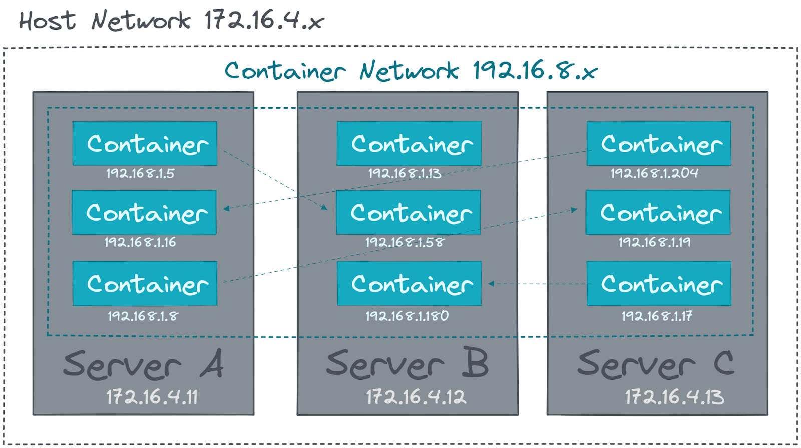

# Networking

- **Microservice Architecture and Network Communication:**
    - Microservice architecture relies heavily on network communication.
    - Unlike monolithic applications, microservices implement interfaces for making requests.
    - Example: A service providing a list of products in an e-commerce application.
- **Network Namespaces and Unique IP Addresses:**
    - Each container in microservices has its unique IP address, facilitated by network namespaces.
    - Allows multiple containers to open the same network port, enabling scenarios like multiple containerized web servers using port 8080.
- **Port Mapping for External Accessibility:**
    - Containers can map a port from the container to a port on the host system.
    - Facilitates external access to the application.
- **Overlay Networks for Inter-Container Communication:**
    - Overlay networks enable communication between containers across hosts.
    - Places containers in a virtual network spanning host systems.
    - Simplifies communication without requiring complex networking and routing configurations by system administrators.
- **Benefits of Overlay Networks:**
    - Facilitate easy communication between containers.
    - Eliminate the need for intricate networking and routing setup.
    - Most overlay networks handle IP address management automatically.
- **Container Networking Standards - Container Network Interface (CNI):**
    - Most modern container networking implementations are based on the Container Network Interface (CNI).
    - CNI is a standard enabling the creation and configuration of network plugins.
    - Allows easy swapping of different plugins in various container orchestration platforms.

### [**Container Orchestration**](https://kevinsulatra.github.io/k8snotes/kcna_notes/container_orchestration/container_orchestration.html)
