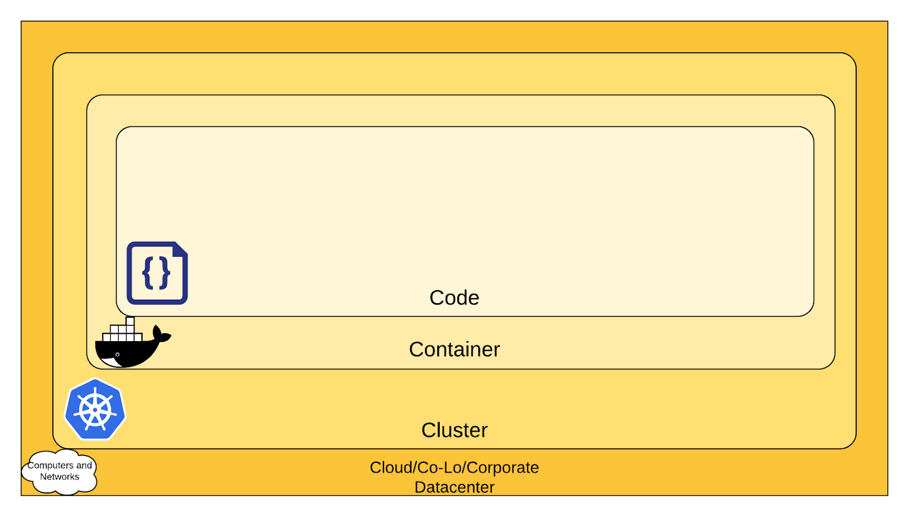

# **Security**

- **Container Security Requirements:**
    - Containers have distinct security needs compared to virtual machines.
    - Relying solely on isolation properties can pose risks.
- **Kernel Sharing Risk:**
    - Containers share the same kernel when started on a machine.
    - Allows potential risks for the entire system if containers can access kernel functions like killing processes or modifying the host network.
    - Understanding kernel capabilities is crucial.
- **Security Risks with Process Privileges:**
    - Executing processes with excessive privileges, especially starting processes as root or administrator, poses significant security risks.
    - Historical negligence in addressing this issue has resulted in numerous containers running as root users.
- **Public Image Risks:**
    - Public image usage introduces a new attack surface.
    - Popular public image registries include Docker Hub and Quay.
    - It's essential to ensure that publicly accessible images have not been altered to include malicious software.
- **Security Best Practices:**
    - [Sysdig](https://sysdig.com/blog/dockerfile-best-practices/) offers insights on avoiding security issues and building secure container images.
    - Security is an ongoing process, not limited to the container layer.
    - The 4C's of Cloud Native security emphasize protecting layers continuously.
    - Refer to Kubernetes documentation for a foundational understanding of layers and security measures.

    
The 4C's of Cloud Native Security
