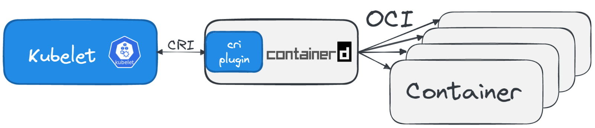

# **Running Containers on Kubernetes**

- **Running Containers in Kubernetes vs. Local Machine:**
    - In Kubernetes, the process of running containers differs from directly running them on a local machine.
    - Instead of starting containers directly, Kubernetes utilizes Pods as the smallest compute unit, acting as a wrapper around a container.
- **Pod Definition in Kubernetes:**
    - When creating a Pod object in Kubernetes, the process involves multiple components.
    - Kubernetes translates the Pod definition into a running container on a node.
- **Understanding Pods in Kubernetes:**
    - **Concept:**
        - Pods are the fundamental compute units in Kubernetes.
        - Act as a wrapper around a container, providing an abstraction layer for containerized applications.
    - **Pod Creation Process:**
        - When a Pod object is created in Kubernetes, it initiates a series of steps.
        - Various components are involved in translating the Pod definition into a running container on a node.
- **Further Learning:**
    - Detailed exploration of Pods and their role in Kubernetes will be covered in subsequent sections.

Here is an example using containerd:

## **Running Containers in Kubernetes**

- **Introduction of Container Runtime Interface (CRI):**
    - **Objective:**
        - Allow the use of container runtimes other than Docker in Kubernetes.
        - Introduced CRI in 2016.
- **Available Container Runtimes with CRI:**
    1. **containerd:**
        - Lightweight and performant container runtime.
        - Arguably the most popular runtime, used by major cloud providers for Kubernetes-as-a-Service products.
    2. **CRI-O:**
        - Created by Red Hat, closely related to podman and buildah.
    3. **Docker:**
        - Former standard but deprecated for Kubernetes runtime as of version 1.24.
        - Kubernetes has addressed concerns regarding Docker usage in a comprehensive blog article.
- **Design Philosophy of containerd and CRI-O:**
    - **Objective:**
        - Provide runtimes containing only essential components for running containers.
    - **Additional Features:**
        - Integration with container runtime sandboxing tools for enhanced security.
        - Common tools include gvisor (by Google) and Kata Containers.
- **Container Runtime Sandbox Tools:**
    1. **gvisor:**
        - Developed by Google.
        - Provides an application kernel between containerized processes and the host kernel.
    2. **Kata Containers:**
        - Secure runtime offering a lightweight virtual machine that behaves like a container.

### [Kubernetes Fundamentals](https://kevinsulatra.github.io/k8snotes/kcna_notes/k8s_fundamentals/k8s_fundamentals.html)
