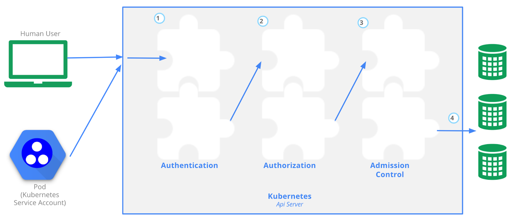

# K8s API

- **Importance of Kubernetes API:**
    - The Kubernetes API stands as the most critical component in a Kubernetes cluster.
    - Essential for communication with the cluster; every user and cluster component relies on the API server.
- **Processing Requests in Kubernetes API:**
    - **Authentication:**
        - Users or components must present a means of identity for authentication.
        - Commonly accomplished with a digitally signed certificate (X.509) or an external identity management system.
        - Kubernetes users are externally managed, and technical users can be authenticated using Service Accounts.
    - **Authorization:**
        - Decides the permissions granted to the requester.
        - Implemented in Kubernetes through Role-Based Access Control (RBAC).
    - **Admission Control:**
        - In the final step, admission controllers can modify or validate the request.
        - Example: An admission controller could block a request to use a container image from an untrustworthy registry.
        - External tools like Open Policy Agent can manage admission control.
- **Kubernetes API Implementation:**
    - Implemented as a RESTful interface exposed over HTTPS.
    - Through the API, users or services can create, modify, delete, or retrieve resources within the Kubernetes cluster.

Access Control Overview, retrieved from the [Kubernetes documentation](https://kubernetes.io/docs/concepts/security/controlling-access/)

### [Kubernetes Fundamentals](https://kevinsulatra.github.io/k8snotes/kcna_notes/k8s_fundamentals/k8s_fundamentals.html)
