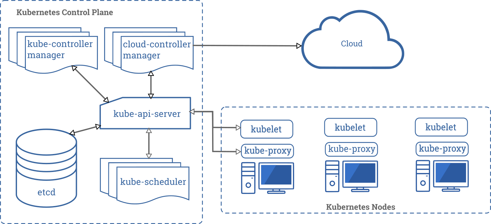

# **Kubernetes Architecture**

- **Kubernetes Cluster Overview:**
    - Kubernetes is commonly utilized as a cluster, distributed across multiple servers to handle diverse tasks and distribute system loads.
    - Designed to meet Google's requirements, where billions of containers start weekly.
    - Boasts high horizontal scalability, enabling clusters with thousands of server nodes across various datacenters and regions.
- **Kubernetes Cluster Components:**
    - **Control Plane Node(s):**
        - Considered the brains of the operation.
        - Houses various components responsible for managing the cluster, overseeing tasks such as deployment, scheduling, and self-healing of containerized workloads.
    - **Worker Nodes:**
        - Dedicated to running applications in the cluster.
        - Sole responsibility is executing applications, lacking additional logic.
        - Behavior, such as initiating a container, is entirely controlled by the control plane node.

Kubernetes Architecture

Control plane nodes in a Kubernetes cluster typically host the following services:

1. **API Server:**
    - Serves as the front-end for the Kubernetes control plane.
    - Validates and processes RESTful API requests, initiating corresponding actions within the cluster.
2. **etcd:**
    - Consistent and highly-available key-value store used as Kubernetes' primary data store.
    - Stores configuration data, ensuring that the entire cluster maintains a consistent state.
3. **Scheduler:**
    - Watches for newly created Pods with no assigned node and selects a node for them to run on.
    - Considers factors such as resource availability, affinity/anti-affinity specifications, and constraints.
4. **Controller Manager:**
    - Runs controller processes, responsible for observing the state of the cluster and making necessary changes to achieve the desired state.
    - Examples include the replication controller, endpoint controller, and namespace controller.
5. **Cloud Controller Manager (Optional):**
    - Communicates with the underlying cloud provider's API to manage resources in the cloud (e.g., load balancers or storage).
    - Specific to cloud-based Kubernetes deployments and is optional based on the environment.

Worker nodes in a Kubernetes cluster typically consist of the following components:

1. **Kubelet:**
    - The primary agent running on each worker node.
    - Responsible for ensuring that containers within Pods are running and healthy.
    - Communicates with the control plane to receive instructions and report the status of its assigned node.
2. **Container Runtime:**
    - The software responsible for running containers, such as Docker, containerd, or cri-o.
    - Implements the Container Runtime Interface (CRI) to interface with the Kubelet.
3. **Kube Proxy:**
    - Maintains network rules on nodes, enabling communication between Pods and external traffic.
    - Implements the Kubernetes Service abstraction, ensuring load balancing and network proxying.
4. **Pods:**
    - Basic building blocks of a Kubernetes application.
    - Containers within a Pod share the same network namespace, enabling them to communicate easily.
5. **cAdvisor (Optional):**
    - Stands for Container Advisor.
    - Collects, aggregates, processes, and exports information about running containers.
    - Optional, but can be used for monitoring and performance analysis.

These components collectively form the worker node, responsible for executing applications and running containers as directed by the control plane.

- **Kubernetes Design Resilience:**
    - Kubernetes' design allows applications on a worker node to persist even if the control plane is unavailable.
    - Existing applications continue to run, ensuring ongoing operation, although certain functionalities (e.g., scaling, scheduling new applications) are hindered during control plane downtime.
- **Kubernetes Namespace Concept:**
    - **Not Kernel Namespaces:**
        - Kubernetes namespaces differ from kernel namespaces used to isolate containers.
    - **Virtual Clusters for Multi-Tenancy:**
        - Kubernetes namespaces divide a cluster into multiple virtual clusters.
        - Useful for multi-tenancy scenarios where multiple teams share a cluster.
    - **Limited Isolation:**
        - Important to note that Kubernetes namespaces don't provide strong isolation.
        - Analogous to a directory on a computer, allowing organization and user access management.
        - Should be viewed as a means to organize objects and control user access within a cluster.

### [Kubernetes Fundamentals](https://kevinsulatra.github.io/k8snotes/kcna_notes/k8s_fundamentals/k8s_fundamentals.html)
